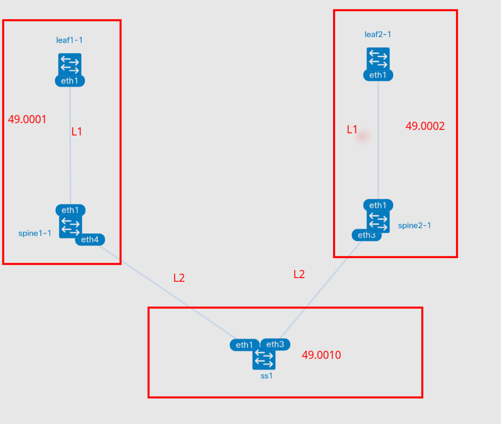

# Underlay. ISIS

- Настроите ISIS в Underlay сети, для IP связанности между всеми сетевыми устройствами.
- Зафиксируете в документации - план работы, адресное пространство, схему сети, конфигурацию устройств
- Убедитесь в наличии IP связанности между устройствами в ISIS домене


## План работ

### Схема сети



### Распределение адресного пространства

Ipv4
| Тип интерфейса | Сеть |
| ---- | ----|
| Lo leaf | 192.168.1DC#.0/24 (eq /32) |
| Lo Spine | 192.168.2DC#.0/24 (eq /32) |
| Lo SS | 192.168.0.0/24 (eq /32)|
| Uplink Spine | 172.16.DC#Spine#.0/24 (eq /31) |
| Uplink SS |172.16.SS#.0/24 (eq /31) |

Ipv6 (аплинки между сетевыми устройствами на link-local)
| Тип сети | Сеть |
|--------|----|
| Lo leaf | fdDC#::1:0/112 (eq /128) |
| Lo Spine | fdDC#::/112 (eq /128) |
| Lo SS | fd00::/112 (eq /128) |

ISIS

### Настройки интерфейсов

Все настройки интерфейсов находятся в файлах setup.sh в соответствующих папках хостов.
Конфигурация устройств находится в файлах frr.conf

## Запуск лабораторной работы

### run.sh

- Для запуска используется скрипт run.sh
- Если в вас установлен Docker, то необходимо убрать ключ --runtime и его аргумент, а также заменить podman на docker

## Результаты

### Проблемы
Лаба была сильно порезана из-за проблем с FRR:
- L1 pdu не переносятся в L2 ([Тут issue](https://github.com/FRRouting/frr/issues/12793))
[Дамп PDU](ws-isis-pdu-l2.png)
- Дамп собирался командой
```bash
sudo ip netns exec clab-isis_lab-ss1 tcpdump -nni eth1 -w - | wireshark -k -i -
```
- При установлении L2 соседства сразу с 2мя девайсами начинает флапать база и, в следствии, маршруты тоже флапают. (И проц в лабе улетает)
```bash
ss1# sh ip route isis
I   172.16.1.0/31 [115/20] via 172.16.1.1, eth1 inactive, weight 1, 00:00:06
                           via 172.16.1.5, eth3, weight 1, 00:00:06
I   172.16.1.4/31 [115/20] via 172.16.1.1, eth1, weight 1, 00:00:03
                           via 172.16.1.5, eth3 inactive, weight 1, 00:00:03
ss1# sh ip route isis

I   172.16.1.0/31 [115/20] via 172.16.1.1, eth1 inactive, weight 1, 00:00:00
                           via 172.16.1.5, eth3, weight 1, 00:00:00
I   172.16.1.4/31 [115/20] via 172.16.1.1, eth1, weight 1, 00:00:03
                           via 172.16.1.5, eth3 inactive, weight 1, 00:00:03
I>* 172.16.11.0/31 [115/20] via 172.16.1.1, eth1, weight 1, 00:00:00
  *                         via 172.16.1.5, eth3, weight 1, 00:00:00
I>* 192.168.21.1/32 [115/20] via 172.16.1.1, eth1, weight 1, 00:00:00
  *                          via 172.16.1.5, eth3, weight 1, 00:00:00
ss1# sh ip route isis

I   172.16.1.0/31 [115/20] via 172.16.1.1, eth1 inactive, weight 1, 00:00:02
                           via 172.16.1.5, eth3, weight 1, 00:00:02
I   172.16.1.4/31 [115/20] via 172.16.1.1, eth1, weight 1, 00:00:00
                           via 172.16.1.5, eth3 inactive, weight 1, 00:00:00
I>* 172.16.21.0/31 [115/20] via 172.16.1.1, eth1, weight 1, 00:00:00
  *                         via 172.16.1.5, eth3, weight 1, 00:00:00
I>* 192.168.22.1/32 [115/20] via 172.16.1.1, eth1, weight 1, 00:00:00
  *                          via 172.16.1.5, eth3, weight 1, 00:00:00
```

### Положительные результаты

- В рамках L1 соседства всё работает прекрасно
``` bash
leaf1-1# sh isis neighbor
Area FOO:
 System Id           Interface   L  State         Holdtime SNPA
 spine1-1            eth1        1  Up            27       2020.2020.2020
```
- Маршруты устанавливаются корректно

``` bash
leaf1-1# sh ip route isis

I>* 0.0.0.0/0 [115/10] via 172.16.11.0, eth1, weight 1, 00:30:42
I>* 172.16.1.0/31 [115/20] via 172.16.11.0, eth1, weight 1, 00:30:42
I   172.16.11.0/31 [115/20] via 172.16.11.0, eth1 inactive, weight 1, 00:45:37
I>* 192.168.21.1/32 [115/20] via 172.16.11.0, eth1, weight 1, 00:45:37
```
