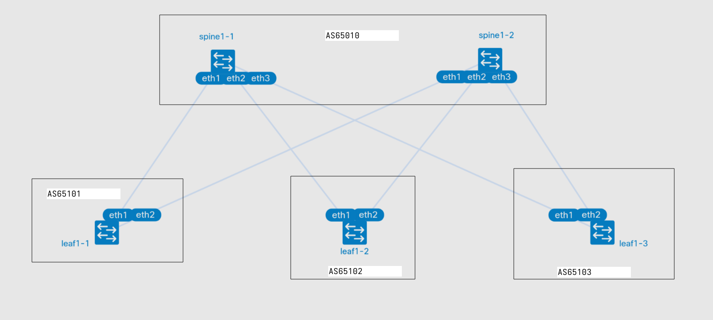

# Underlay. BGP

- Настроите BGP в Underlay сети, для IP связанности между всеми сетевыми устройствами. iBGP или **eBGP**
- Зафиксируете в документации - план работы, адресное пространство, схему сети, конфигурацию устройств
- Убедитесь в наличии IP связанности между устройствами в BGP домене

## План работы

### Схема сети



### Распределение адресного пространства

Аплинки на ll ipv6 (rfc 8950)

Ipv4
| Тип интерфейса | Сеть |
|----|----|
| Lo leaf | 192.168.{#DC}1.0/24 (eq /32) |
| Lo Spine | 192.168.{#DC}2.0/24 (eq /32) |


Ipv6
| Тип сети | Сеть |
|--------|----|
| Lo leaf | fd{#DC}::1:0/112 (eq /128) |
| Lo Spine | fd{#DC}::/112 (eq /128) |

AS
| Type | AS |
|----|----|
| Leafs | 65{#DC}01-65{#DC}99 |
| Spines | 650{#DC}0 |


### BGP

### Настройки интерфейсов

Конфигурация устройств находится в соотвествующих папках хостов в файле startup-configs

Шаблоны настроек
Leaf
```
#Включил ipv6 на аплинках
interface Ethernet1/1
   no switchport
   ipv6 enable
!
interface Ethernet1/2
   no switchport
   ipv6 enable
!
interface Loopback0
   ip address 192.168.11.{ID}/32
   ipv6 address fd01::1:{ID}/128
!
ip routing
!
# Нужно для включиния маршрутизации ipv4 через ipv6
ip routing ipv6 interfaces
!
ipv6 unicast-routing
!
router bgp 6510{ID}
   router-id 192.168.11.{ID}
   # для выделения отдельного ipv4 af
   no bgp default ipv4-unicast
   # включил ecmp
   maximum-paths 4 ecmp 4
   # таймеры для ускорения сходимости
   timers bgp 3 9
   # создание peer-group
   neighbor BGP peer group
   # установление соседства через интерфейс
   neighbor interface Et1/1-2 peer-group BGP remote-as 65010
   neighbor BGP bfd
   !
   address-family ipv4
      neighbor BGP activate
      # включение получения ipv4 маршрутов через ipv6
      neighbor BGP next-hop address-family ipv6 originate
      network 192.168.11.{ID}/32
   !
   address-family ipv6
      neighbor BGP activate
      network fd01::1:{ID}/128
```
Spine (комментарии только к отличающимся конфигам)

```
interface Ethernet1/1
   no switchport
   ipv6 enable
!
interface Ethernet1/2
   no switchport
   ipv6 enable
!
interface Ethernet1/3
   no switchport
   ipv6 enable
!
interface Loopback0
   ip address 192.168.12.{ID}/32
   ipv6 address fd01::{ID}/128
!
ip routing
!
ip routing ipv6 interfaces
!
ipv6 unicast-routing
!
# фильтр для установления eBGP только с определенным AS
peer-filter LEAFS
   10 match as-range 65101-65199 result accept
!
router bgp 65010
   router-id 192.168.12.{ID}
   no bgp default ipv4-unicast
   neighbor BGP peer group
   # применение фильтра
   neighbor interface Et1/1-3 peer-group BGP peer-filter LEAFS
   timers bgp 3 9
   neighbor BGP bfd
   !
   address-family ipv4
      neighbor BGP activate
      neighbor BGP next-hop address-family ipv6 originate
      network 192.168.12.{ID}/32
   !
   address-family ipv6
      neighbor BGP activate
      network fd01::{ID}/128
```
## Запуск лабораторной работы

### run.sh

- Для запуска используется скрипт run.sh
- Если в вас установлен Docker, то необходимо убрать ключ --runtime и его аргумент

## Результаты

### Соседство

На всех leaf было установлено по 2 соседства

```
leaf1-1#sh ip bgp summary
BGP summary information for VRF default
Router identifier 192.168.11.1, local AS number 65101
Neighbor Status Codes: m - Under maintenance
  Neighbor                        V AS           MsgRcvd   MsgSent  InQ OutQ  Up/Down State   PfxRcd PfxAcc PfxAdv
  fe80::a8c1:abff:fe5c:a4da%Et1/1 4 65010             72        74    0    0 00:02:39 Estab   3      3      4
  fe80::a8c1:abff:fe68:c86d%Et1/2 4 65010             75        72    0    0 00:02:42 Estab   3      3      2

```

На spine по 3
```
spine1-1#sh ip bgp summary
BGP summary information for VRF default
Router identifier 192.168.12.1, local AS number 65010
Neighbor Status Codes: m - Under maintenance
  Neighbor                        V AS           MsgRcvd   MsgSent  InQ OutQ  Up/Down State   PfxRcd PfxAcc PfxAdv
  fe80::a8c1:abff:fe41:b6cc%Et1/2 4 65102            105       100    0    0 00:03:56 Estab   1      1      3
  fe80::a8c1:abff:fecd:5322%Et1/1 4 65101            104       100    0    0 00:03:54 Estab   1      1      3
  fe80::a8c1:abff:feeb:5609%Et1/3 4 65103            103       100    0    0 00:03:52 Estab   1      1      3

```

### Маршруты

На spine есть все маршруты до lo всех leaf. До lo второго спайна нет (они в одной as)
```
spine1-1#sh ip route bgp

VRF: default

 B E      192.168.11.1/32 [200/0]
           via fe80::a8c1:abff:fecd:5322, Ethernet1/1
 B E      192.168.11.2/32 [200/0]
           via fe80::a8c1:abff:fe41:b6cc, Ethernet1/2
 B E      192.168.11.3/32 [200/0]
           via fe80::a8c1:abff:feeb:5609, Ethernet1/3
```
```
spine1-1#sh ipv6 route bgp

VRF: default
 B E      fd01::1:1/128 [200/0]
           via fe80::a8c1:abff:fecd:5322, Ethernet1/1
 B E      fd01::1:2/128 [200/0]
           via fe80::a8c1:abff:fe41:b6cc, Ethernet1/2
 B E      fd01::1:3/128 [200/0]
           via fe80::a8c1:abff:feeb:5609, Ethernet1/3

```

На leaf есть маршруты до всех lo, до lo других leaf их по 2
```
leaf1-1#sh ip ro bgp

VRF: default
 B E      192.168.11.2/32 [200/0]
           via fe80::a8c1:abff:fe5c:a4da, Ethernet1/1
           via fe80::a8c1:abff:fe68:c86d, Ethernet1/2
 B E      192.168.11.3/32 [200/0]
           via fe80::a8c1:abff:fe5c:a4da, Ethernet1/1
           via fe80::a8c1:abff:fe68:c86d, Ethernet1/2
 B E      192.168.12.1/32 [200/0]
           via fe80::a8c1:abff:fe5c:a4da, Ethernet1/1
 B E      192.168.12.2/32 [200/0]
           via fe80::a8c1:abff:fe68:c86d, Ethernet1/2

```
```
leaf1-1#sh ipv6 ro bgp

VRF: default
 B E      fd01::1/128 [200/0]
           via fe80::a8c1:abff:fe5c:a4da, Ethernet1/1
 B E      fd01::2/128 [200/0]
           via fe80::a8c1:abff:fe68:c86d, Ethernet1/2
 B E      fd01::1:2/128 [200/0]
           via fe80::a8c1:abff:fe5c:a4da, Ethernet1/1
           via fe80::a8c1:abff:fe68:c86d, Ethernet1/2
 B E      fd01::1:3/128 [200/0]
           via fe80::a8c1:abff:fe5c:a4da, Ethernet1/1
           via fe80::a8c1:abff:fe68:c86d, Ethernet1/2

```
### Траффик

Пинг проходит и по ipv4 и по ipv6
```
leaf1-1#ping 192.168.11.3
PING 192.168.11.3 (192.168.11.3) 72(100) bytes of data.
80 bytes from 192.168.11.3: icmp_seq=1 ttl=64 time=1.07 ms
80 bytes from 192.168.11.3: icmp_seq=2 ttl=64 time=0.450 ms
80 bytes from 192.168.11.3: icmp_seq=3 ttl=64 time=0.430 ms
80 bytes from 192.168.11.3: icmp_seq=4 ttl=64 time=0.447 ms

--- 192.168.11.3 ping statistics ---
5 packets transmitted, 4 received, 20% packet loss, time 4ms
rtt min/avg/max/mdev = 0.430/0.598/1.066/0.270 ms, ipg/ewma 1.045/0.860 ms
```
```
leaf1-1#ping ipv6 fd01::1:3
PING fd01::1:3(fd01::1:3) 52 data bytes
60 bytes from fd01::1:3: icmp_seq=1 ttl=63 time=0.854 ms
60 bytes from fd01::1:3: icmp_seq=2 ttl=63 time=0.645 ms
60 bytes from fd01::1:3: icmp_seq=3 ttl=63 time=0.473 ms
60 bytes from fd01::1:3: icmp_seq=4 ttl=63 time=0.560 ms
60 bytes from fd01::1:3: icmp_seq=5 ttl=63 time=0.497 ms

--- fd01::1:3 ping statistics ---
5 packets transmitted, 5 received, 0% packet loss, time 4ms
rtt min/avg/max/mdev = 0.473/0.605/0.854/0.137 ms, ipg/ewma 1.007/0.723 ms
```

Трейс по ipv6 покажет полный путь
```
leaf1-1#traceroute ipv6 fd01::1:3
traceroute to fd01::1:3 (fd01::1:3), 30 hops max, 80 byte packets
 1  fd01::2 (fd01::2)  0.203 ms  0.134 ms  0.122 ms
 2  fd01::1:3 (fd01::1:3)  2.229 ms  2.307 ms  2.869 ms
```

А по ipv4 только конечную точку
```
leaf1-1#traceroute 192.168.11.3
traceroute to 192.168.11.3 (192.168.11.3), 30 hops max, 60 byte packets
 1  192.168.11.3 (192.168.11.3)  2.079 ms  2.723 ms  2.900 ms
```
Что всё честно можно посмотреть в tcpdump (дамп не полный, но видно даже ecmp)
```
leaf1-3#tcpdump interface any filter host 192.168.11.1
tcpdump: verbose output suppressed, use -v[v]... for full protocol decode
listening on any, link-type LINUX_SLL2 (Linux cooked v2), snapshot length 262144 bytes
13:29:39.250832 eth1  In  ifindex 95 aa:c1:ab:59:d0:ef ethertype IPv4 (0x0800), length 80: 192.168.11.1.35524 > 192.168.11.3.traceroute: UDP, length 32
13:29:39.250882 fwd0  Out ifindex 9 00:1c:73:c0:ec:d1 ethertype IPv4 (0x0800), length 108: 192.168.11.3 > 192.168.11.1: ICMP 192.168.11.3 udp port traceroute unreachable, length 68
13:29:39.251099 eth1  In  ifindex 95 aa:c1:ab:59:d0:ef ethertype IPv4 (0x0800), length 80: 192.168.11.1.54460 > 192.168.11.3.33437: UDP, length 32
13:29:39.251120 fwd0  Out ifindex 9 00:1c:73:c0:ec:d1 ethertype IPv4 (0x0800), length 108: 192.168.11.3 > 192.168.11.1: ICMP 192.168.11.3 udp port 33437 unreachable, length 68
13:29:39.251210 eth2  In  ifindex 99 aa:c1:ab:6e:1d:32 ethertype IPv4 (0x0800), length 80: 192.168.11.1.34270 > 192.168.11.3.33435: UDP, length 32
```
