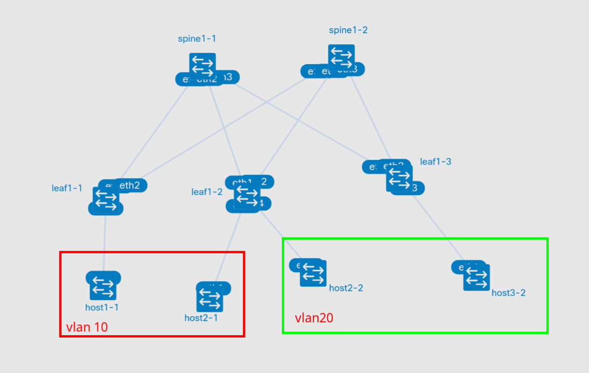
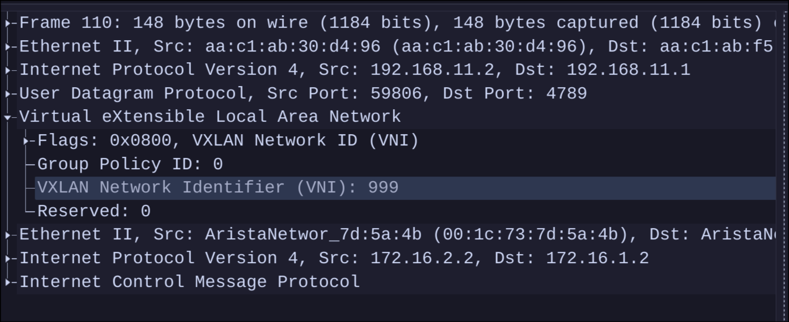

# VxLAN. L3 VNI

- Настроите каждого клиента в своем VNI
- Настроите маршрутизацию между клиентами.
- Зафиксируете в документации - план работы, адресное пространство, схему сети, конфигурацию устройств


## План работы

### Схема сети



### Распределение адресного пространства

Аплинки на ll ipv6 (rfc 8950)

Ipv4
| Тип интерфейса | Сеть |
|----|----|
| Lo leaf | 192.168.{#DC}1.0/24 (eq /32) |
| Lo Spine | 192.168.{#DC}2.0/24 (eq /32) |


Ipv6
| Тип сети | Сеть |
|--------|----|
| Lo leaf | fd{#DC}::1:0/112 (eq /128) |
| Lo Spine | fd{#DC}::/112 (eq /128) |

AS
| Type | AS |
|----|----|
| Leafs | 65{#DC}01-65{#DC}99 |
| Spines | 650{#DC}0 |


### BGP

### Настройки интерфейсов

Конфигурация устройств находится в соотвествующих папках хостов в файле startup-configs

Шаблоны настроек (только недостающее в lab05)

Leaf (на spine настройки не меняются)
```
#для AGW
ip virtual-router mac-address c001.cafe.babe
!
vrf instance SEC1
!
ip routing vrf SEC1
!
interface Vxlan1
   vxlan vrf SEC1 vni 999
!
router bgp 6510n
   vrf SEC1
      rd RouterID:999
      route-target import evpn 65010:999
      route-target export evpn 65010:999
!

interface Vlann0
   vrf SEC1
   ip address virtual 172.16.n.1/24

# Для leaf 3 (просто для теста)
interface Ethernet1/4
   vrf SEC1
   ip address 172.16.3.1/24
   ip address virtual 172.16.3.1/24
   !
```


## Запуск лабораторной работы

### run.sh

- Для запуска используется скрипт run.sh
- Если в вас установлен Docker, то необходимо убрать ключ --runtime и его аргумент

## Результаты

### evpn
Появились маршруты типа 2 с ip адресами
```
* >Ec    RD: 192.168.11.1:10 mac-ip aac1.ab87.ba51 172.16.1.2
                                192.168.11.1          -       100     0       65010 65101 i
*  ec    RD: 192.168.11.1:10 mac-ip aac1.ab87.ba51 172.16.1.2
                                192.168.11.1          -       100     0       65010 65101 i

```


### host
Пинг с хоста l3 проходит до любого хоста в любом влан. Только сначала надо как-то обозначить что хост есть (запустить с него пинг)

Пример:
```
ping 172.16.1.2
PING 172.16.1.2 (172.16.1.2) 56(84) bytes of data.
64 bytes from 172.16.1.2: icmp_seq=1 ttl=62 time=3.73 ms
64 bytes from 172.16.1.2: icmp_seq=2 ttl=62 time=2.55 ms
64 bytes from 172.16.1.2: icmp_seq=3 ttl=62 time=2.38 ms
64 bytes from 172.16.1.2: icmp_seq=4 ttl=62 time=2.83 ms
64 bytes from 172.16.1.2: icmp_seq=5 ttl=62 time=2.67 ms
64 bytes from 172.16.1.2: icmp_seq=6 ttl=62 time=2.46 ms

```


### Дамп
Снимается командой (слушать сразу оба интерфейса к спайну)
```
sudo ip netns exec clab-evpn_l2_l3_lab-leaf1-2 tcpdump -nni eth1 -nni eth2  -w - | wireshark -k -i -
```

И запускаем пинг с хоста 1-1 к хосту 2-2



На дампе видно что vni = 999
