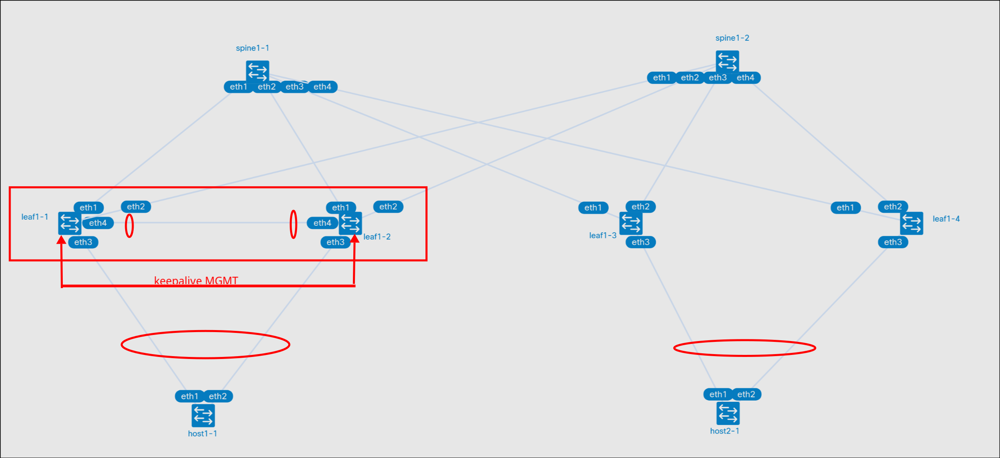

# VxLAN. Multihoming


- Подключите клиентов 2-я линками к различным Leaf
- Настроите агрегированный канал со стороны клиента
- Настроите multihoming для работы в Overlay сети. Если используете Cisco NXOS - vPC, если иной вендор - то ESI LAG (либо MC-LAG с поддержко- VXLAN)
- Зафиксируете в документации - план работы, адресное пространство, схему сети, конфигурацию устройств
- Опционально - протестировать отказоустойчивость - убедиться, что связнность не теряется при отключении одного из линков


## План работы

### Схема сети



### Распределение адресного пространства

Аплинки на ll ipv6 (rfc 8950)

Ipv4
| Тип интерфейса | Сеть |
|----|----|
| Lo leaf | 192.168.{#DC}1.0/24 (eq /32) |
| Lo Spine | 192.168.{#DC}2.0/24 (eq /32) |


Ipv6
| Тип сети | Сеть |
|--------|----|
| Lo leaf | fd{#DC}::1:0/112 (eq /128) |
| Lo Spine | fd{#DC}::/112 (eq /128) |

AS
| Type | AS |
|----|----|
| Leafs | 65{#DC}01-65{#DC}99 |
| Spines | 650{#DC}0 |


## MLAG

leaf1-1 и leaf1-2 настроены в MLAG пару, настроки на обоих устройствах одинаковые, меняются только peer-link и keepalive ip

mgmt ip прописаны в файле с топологией

```
vlan 4090
   name mlag-peer
   trunk group mlag-peer

interface Port-Channel999
   description MLAG Peer
   switchport mode trunk
   switchport trunk group mlag-peer
   spanning-tree link-type point-to-point

interface Ethernet1/4
   description mlag peer link
   channel-group 999 mode active

mlag configuration
   domain-id leafs
   local-interface Vlan4090
   peer-address 10.0.199.255
   peer-address heartbeat 172.20.20.101
   peer-link Port-Channel999
   # отключение всех downlinks при аврии
   dual-primary detection delay 10 action errdisable all-interfaces
```

Далее настраивается iBGP между нодами пары (и новый lo1 для vxlan)
Нужно для случаев если пропал линк до spine, тогда трафик будет перенаправлен на другой leaf
```
interface Loopback1
   description VXLAN-VTEP
   ip address 192.168.11.11/32
interface Vxlan1
   vxlan source-interface Loopback1
router bgp 65101
  neighbor UNDERLAY-MLAG peer group
  neighbor UNDERLAY-MLAG remote-as 65101
  neighbor UNDERLAY-MLAG next-hop-self
  neighbor 10.0.199.255 peer group UNDERLAY-MLAG
  !
  address-family ipv4
    neighbor UNDERLAY-MLAG activate
    # анонсируем оба lo
    network 192.168.11.1/32
    network 192.168.11.11/32
```
В целом для фабрики ничего не изменится, только next-hop будет уже на адрес Loopback1 (в результатах)

## ESI

Вторая пара Leaf настроена в esi. Настройки также одинаковы, кроме preference.

```
interface Ethernet1/3
   channel-group 20 mode active
interface Port-Channel20
   description Link_to_Client
   switchport access vlan 20
   !
   evpn ethernet-segment
      identifier 0000:0000:0000:0000:0001
      designated-forwarder election algorithm preference 100
      route-target import 00:00:00:00:00:01
   lacp system-id 02aa.aaaa.0001
!
```

## Запуск лабораторной работы

spine в лабораторной работе заменены на frr. Настройки минимальны и несильно отличаются от стандартных.
Потребовались дополнительные опции для включения ecmp
```
router bgp 65010
 bgp bestpath as-path multipath-relax
 bgp bestpath bandwidth skip-missing
```

### run.sh

- Для запуска используется скрипт run.sh
- Если в вас установлен Docker, то необходимо убрать ключ --runtime и его аргумент

## Результаты

### mclag
Новые type3 с lo1 каждого leaf пары (видно по rd)
```
* >Ec    RD: 192.168.11.1:10 imet 192.168.11.11
                                192.168.11.11         -       100     0       65010 65101 i
*  ec    RD: 192.168.11.1:10 imet 192.168.11.11
                                192.168.11.11         -       100     0       65010 65101 i
* >Ec    RD: 192.168.11.2:10 imet 192.168.11.11
                                192.168.11.11         -       100     0       65010 65101 i
*  ec    RD: 192.168.11.2:10 imet 192.168.11.11
                                192.168.11.11         -       100     0       65010 65101 i
```
И type2 аналогично
```
* >Ec    RD: 192.168.11.1:10 mac-ip aac1.ab20.928c 172.16.1.2
                                192.168.11.11         -       100     0       65010 65101 i
*  ec    RD: 192.168.11.1:10 mac-ip aac1.ab20.928c 172.16.1.2
                                192.168.11.11         -       100     0       65010 65101 i
* >Ec    RD: 192.168.11.2:10 mac-ip aac1.ab20.928c 172.16.1.2
                                192.168.11.11         -       100     0       65010 65101 i
*  ec    RD: 192.168.11.2:10 mac-ip aac1.ab20.928c 172.16.1.2
                                192.168.11.11         -       100     0       65010 65101 i
```

### Ethernet segment

Type 4 маршруты для каждого свича в es 1 (2 штуки для каждого из-за ecmp). Тут же видно preference для выбора DF
```
Router identifier 192.168.11.1, local AS number 65101
BGP routing table entry for ethernet-segment 0000:0000:0000:0000:0001 192.168.11.3, Route Distinguisher: 192.168.11.3:1
 Paths: 2 available
  65010 65103
    192.168.11.3 from 192.168.12.2 (192.168.12.2)
      Origin IGP, metric -, localpref 100, weight 0, tag 0, valid, external, ECMP head, ECMP, best, ECMP contributor
      Extended Community: TunnelEncap:tunnelTypeVxlan EvpnEsImportRt:00:00:00:00:00:01 DF Election: Preference 100
  65010 65103
    192.168.11.3 from 192.168.12.1 (192.168.12.1)
      Origin IGP, metric -, localpref 100, weight 0, tag 0, valid, external, ECMP, ECMP contributor
      Extended Community: TunnelEncap:tunnelTypeVxlan EvpnEsImportRt:00:00:00:00:00:01 DF Election: Preference 100
BGP routing table entry for ethernet-segment 0000:0000:0000:0000:0001 192.168.11.4, Route Distinguisher: 192.168.11.4:1
 Paths: 2 available
  65010 65104
    192.168.11.4 from 192.168.12.2 (192.168.12.2)
      Origin IGP, metric -, localpref 100, weight 0, tag 0, valid, external, ECMP head, ECMP, best, ECMP contributor
      Extended Community: TunnelEncap:tunnelTypeVxlan EvpnEsImportRt:00:00:00:00:00:01 DF Election: Preference 90
  65010 65104
    192.168.11.4 from 192.168.12.1 (192.168.12.1)
      Origin IGP, metric -, localpref 100, weight 0, tag 0, valid, external, ECMP, ECMP contributor
      Extended Community: TunnelEncap:tunnelTypeVxlan EvpnEsImportRt:00:00:00:00:00:01 DF Election: Preference 90
```
И с leaf1-3
```
leaf1-3#sh bgp evpn instance
EVPN instance: VLAN 20
  Route distinguisher: 192.168.11.3:20
  Route target import: Route-Target-AS:65010:10020
  Route target export: Route-Target-AS:65010:10020
  Service interface: VLAN-based
  Local VXLAN IP address: 192.168.11.3
  VXLAN: enabled
  MPLS: disabled
  Local ethernet segment:
    ESI: 0000:0000:0000:0000:0001
      Type: 0 (administratively configured)
      Interface: Port-Channel20
      Mode: all-active
      State: up
      ES-Import RT: 00:00:00:00:00:01
      DF election algorithm: preference
      Designated forwarder: 192.168.11.3
      Non-Designated forwarder: 192.168.11.4
```

И type 1 маршруты.

```
BGP routing table entry for auto-discovery 0 0000:0000:0000:0000:0001, Route Distinguisher: 192.168.11.3:20
 Paths: 2 available
  65010 65103
    192.168.11.3 from 192.168.12.2 (192.168.12.2)
      Origin IGP, metric -, localpref 100, weight 0, tag 0, valid, external, ECMP head, ECMP, best, ECMP contributor
      Extended Community: Route-Target-AS:65010:10020 TunnelEncap:tunnelTypeVxlan
      VNI: 0
  65010 65103
    192.168.11.3 from 192.168.12.1 (192.168.12.1)
      Origin IGP, metric -, localpref 100, weight 0, tag 0, valid, external, ECMP, ECMP contributor
      Extended Community: Route-Target-AS:65010:10020 TunnelEncap:tunnelTypeVxlan
      VNI: 0
BGP routing table entry for auto-discovery 0 0000:0000:0000:0000:0001, Route Distinguisher: 192.168.11.4:20
 Paths: 2 available
  65010 65104
    192.168.11.4 from 192.168.12.1 (192.168.12.1)
      Origin IGP, metric -, localpref 100, weight 0, tag 0, valid, external, ECMP head, ECMP, best, ECMP contributor
      Extended Community: Route-Target-AS:65010:10020 TunnelEncap:tunnelTypeVxlan
      VNI: 0
  65010 65104
    192.168.11.4 from 192.168.12.2 (192.168.12.2)
      Origin IGP, metric -, localpref 100, weight 0, tag 0, valid, external, ECMP, ECMP contributor
      Extended Community: Route-Target-AS:65010:10020 TunnelEncap:tunnelTypeVxlan
      VNI: 0
BGP routing table entry for auto-discovery 0000:0000:0000:0000:0001, Route Distinguisher: 192.168.11.3:1
 Paths: 2 available, Priority: high
  65010 65103
    192.168.11.3 from 192.168.12.1 (192.168.12.1)
      Origin IGP, metric -, localpref 100, weight 0, tag 0, valid, external, ECMP head, ECMP, best, ECMP contributor
      Extended Community: Route-Target-AS:65010:10020 TunnelEncap:tunnelTypeVxlan EvpnEsiLabel:0
      VNI: 0
  65010 65103
    192.168.11.3 from 192.168.12.2 (192.168.12.2)
      Origin IGP, metric -, localpref 100, weight 0, tag 0, valid, external, ECMP, ECMP contributor
      Extended Community: Route-Target-AS:65010:10020 TunnelEncap:tunnelTypeVxlan EvpnEsiLabel:0
      VNI: 0
BGP routing table entry for auto-discovery 0000:0000:0000:0000:0001, Route Distinguisher: 192.168.11.4:1
 Paths: 2 available, Priority: high
  65010 65104
    192.168.11.4 from 192.168.12.1 (192.168.12.1)
      Origin IGP, metric -, localpref 100, weight 0, tag 0, valid, external, ECMP head, ECMP, best, ECMP contributor
      Extended Community: Route-Target-AS:65010:10020 TunnelEncap:tunnelTypeVxlan EvpnEsiLabel:0
      VNI: 0
  65010 65104
    192.168.11.4 from 192.168.12.2 (192.168.12.2)
      Origin IGP, metric -, localpref 100, weight 0, tag 0, valid, external, ECMP, ECMP contributor
      Extended Community: Route-Target-AS:65010:10020 TunnelEncap:tunnelTypeVxlan EvpnEsiLabel:0
      VNI: 0
```

Для маршрутов с rd :20 vni должен быть равен 10020, но тут он равен 0 (видимо frr не передает этот параметр, вот он выстрел в ногу)
На leaf1-3 локально этот vni есть (per EVI)

```
BGP routing table entry for auto-discovery 0 0000:0000:0000:0000:0001, Route Distinguisher: 192.168.11.3:20
 Paths: 1 available
  Local
    - from - (0.0.0.0)
      Origin IGP, metric -, localpref -, weight 0, tag 0, valid, local, best
      Extended Community: Route-Target-AS:65010:10020 TunnelEncap:tunnelTypeVxlan
      VNI: 10020
```

Per ESI работают как и должны. Скорее всего проблемы начнутся если добавить еще сегментов или вланов в Portchannel

В целом всё работает, хотя отказоустойчивость протестировать в контейнерах не получилось. Если выключить интерфейсы с одной стороны, то на другой стороне линка порт не упадет (скорее всего связанно с тем, что линк не прямой, а между namespaces проброшен veth и всё это в бриджах и гасить надо их, но там будут пляски с областями видимости namespaces)
