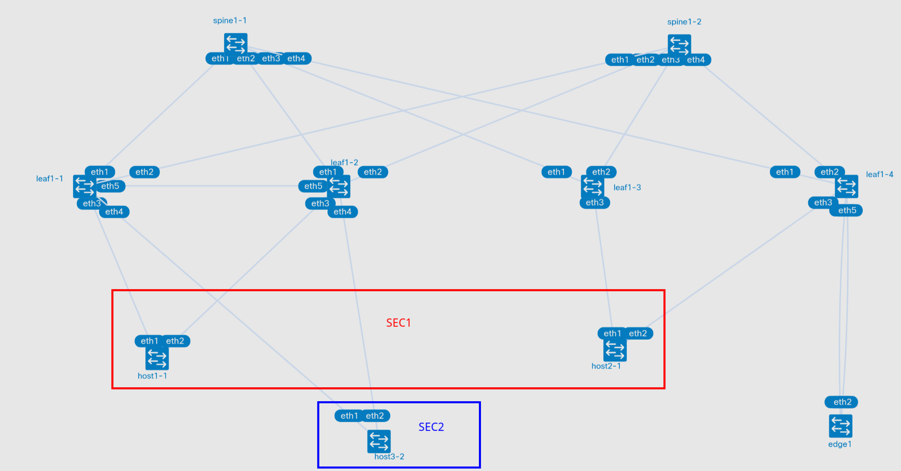

# VxLAN. Routing


- Разместите двух "клиентов" в разных VRF в рамках одной фабрики.
- Настроите маршрутизацию между клиентами через внешнее устройство (граничный роутер\фаерволл\etc)
- Зафиксируйте в документации - план работы, адресное пространство, схему сети, настройки сетевого оборудования

## План работы

### Схема сети



### Распределение адресного пространства

Аплинки на ll ipv6 (rfc 8950)

Ipv4
| Тип интерфейса | Сеть |
|----|----|
| Lo leaf | 192.168.{#DC}1.0/24 (eq /32) |
| Lo Spine | 192.168.{#DC}2.0/24 (eq /32) |


Ipv6
| Тип сети | Сеть |
|--------|----|
| Lo leaf | fd{#DC}::1:0/112 (eq /128) |
| Lo Spine | fd{#DC}::/112 (eq /128) |

AS
| Type | AS |
|----|----|
| Leafs | 65{#DC}01-65{#DC}99 |
| Spines | 650{#DC}0 |
| Edge | 65500 |

vrf
| Name | Net |
|----|----|
| SEC1 | 172.16.0.0/16 |
| SEC2 | 172.17.0.0/16 |

## VRF

Настроил 2 vrf на лифах, на которых будут клиенты в этих vrf (mlag пара leaf1-1 leaf2-1), а также на бордер лифе leaf1-4
```
vrf instance SEC1
!
vrf instance SEC2
!
interface Vlan10
   vrf SEC1
   ip address virtual 172.16.1.1/24
!
interface Vlan30
   vrf SEC2
   ip address virtual 172.17.1.1/24
!
```

И настроил редистрибьюцию коннектед сетей.
```
router bgp 65101
  vrf SEC1
    rd 192.168.11.1:999
    route-target import evpn 65010:999
    route-target export evpn 65010:999
    redistribute connected
  !
  vrf SEC2
    rd 192.168.11.1:1000
    route-target import evpn 65010:1000
    route-target export evpn 65010:1000
    redistribute connected
```

Плюс на edge-leaf настроил пиринг в каждом vrf с edge роутером (через ipv6 ll не вышло, не прописываются в af ipv4)
```
interface Ethernet1/4
   no switchport
   vrf SEC1
   ip address 10.1.0.0/31
   ipv6 enable
!
interface Ethernet1/5
   no switchport
   vrf SEC2
   ip address 10.2.0.0/31
   ipv6 enable
!
router bgp 65104
  vrf SEC1
    rd 192.168.11.4:999
    route-target import evpn 65010:999
    route-target export evpn 65010:999
    neighbor 10.1.0.1 remote-as 65500
    redistribute connected
    !
    address-family ipv4
        neighbor 10.1.0.1 activate
  !
  vrf SEC2
    rd 192.168.11.4:1000
    route-target import evpn 65010:1000
    route-target export evpn 65010:1000
    neighbor 10.2.0.1 remote-as 65500
    redistribute connected
    !
    address-family ipv4
        neighbor 10.2.0.1 activate
```
А на на самом edge1 анаонсировал дефолт в оба VRF
```
router bgp 65500
 neighbor 10.1.0.0 remote-as external
 neighbor 10.2.0.0 remote-as external
 !
 address-family ipv4 unicast
  network 0.0.0.0/0
  neighbor 10.1.0.0 activate
  neighbor 10.2.0.0 activate
 exit-address-family
exit
```

## Запуск лабораторной работы

spine в лабораторной работе заменены на frr. Настройки минимальны и несильно отличаются от стандартных.
Потребовались дополнительные опции для включения ecmp
```
router bgp 65010
 bgp bestpath as-path multipath-relax
 bgp bestpath bandwidth skip-missing
```

### run.sh

- Для запуска используется скрипт run.sh
- Если в вас установлен Docker, то необходимо убрать ключ --runtime и его аргумент

## Результаты

### Edge
На роутере появились все маршруты, которые планировалось анаонсировать из фабрики
```
edge1# sh ip ro bgp
B   10.1.0.0/31 [20/0] via 10.1.0.0 inactive, weight 1, 01:51:52
B   10.2.0.0/31 [20/0] via 10.2.0.0 inactive, weight 1, 01:50:32
B>* 172.16.1.0/24 [20/0] via 10.1.0.0, eth1, weight 1, 01:51:52
B>* 172.16.2.0/24 [20/0] via 10.1.0.0, eth1, weight 1, 01:51:52
B>* 172.17.1.0/24 [20/0] via 10.2.0.0, eth2, weight 1, 01:50:32
```
### Фабрика
На лифах появились маршруты type 5 (дефолт с next-hop адресом leaf1-4)
```
* >Ec    RD: 192.168.11.4:999 ip-prefix 0.0.0.0/0
                                192.168.11.4          -       100     0       65010 65104 65500 i
*  ec    RD: 192.168.11.4:999 ip-prefix 0.0.0.0/0
                                192.168.11.4          -       100     0       65010 65104 65500 i
* >Ec    RD: 192.168.11.4:1000 ip-prefix 0.0.0.0/0
                                192.168.11.4          -       100     0       65010 65104 65500 i
*  ec    RD: 192.168.11.4:1000 ip-prefix 0.0.0.0/0
                                192.168.11.4          -       100     0       65010 65104 65500 i
* >Ec    RD: 192.168.11.4:999 ip-prefix 10.1.0.0/31
                                192.168.11.4          -       100     0       65010 65104 i
*  ec    RD: 192.168.11.4:999 ip-prefix 10.1.0.0/31
                                192.168.11.4          -       100     0       65010 65104 i
* >Ec    RD: 192.168.11.4:1000 ip-prefix 10.2.0.0/31
                                192.168.11.4          -       100     0       65010 65104 i
*  ec    RD: 192.168.11.4:1000 ip-prefix 10.2.0.0/31
                                192.168.11.4          -       100     0       65010 65104 i
* >      RD: 192.168.11.1:999 ip-prefix 172.16.1.0/24
                                -                     -       -       0       i
* >Ec    RD: 192.168.11.3:999 ip-prefix 172.16.2.0/24
                                192.168.11.3          -       100     0       65010 65103 i
*  ec    RD: 192.168.11.3:999 ip-prefix 172.16.2.0/24
                                192.168.11.3          -       100     0       65010 65103 i
* >Ec    RD: 192.168.11.4:999 ip-prefix 172.16.2.0/24
                                192.168.11.4          -       100     0       65010 65104 i
*  ec    RD: 192.168.11.4:999 ip-prefix 172.16.2.0/24
                                192.168.11.4          -       100     0       65010 65104 i
* >      RD: 192.168.11.1:1000 ip-prefix 172.17.1.0/24
                                -                     -       -       0       i
```
И маргруты в af ipv4
```
leaf1-1#sh ip route vrf SEC1

VRF: SEC1
Gateway of last resort:
 B E      0.0.0.0/0 [200/0]
           via VTEP 192.168.11.4 VNI 999 router-mac 00:1c:73:61:e5:34 local-interface Vxlan1

 B E      10.1.0.0/31 [200/0]
           via VTEP 192.168.11.4 VNI 999 router-mac 00:1c:73:61:e5:34 local-interface Vxlan1
 C        172.16.1.0/24
           directly connected, Vlan10
 B E      172.16.2.2/32 [200/0]
           via VTEP 192.168.11.4 VNI 999 router-mac 00:1c:73:61:e5:34 local-interface Vxlan1
           via VTEP 192.168.11.3 VNI 999 router-mac 00:1c:73:c0:ec:d1 local-interface Vxlan1
 B E      172.16.2.0/24 [200/0]
           via VTEP 192.168.11.4 VNI 999 router-mac 00:1c:73:61:e5:34 local-interface Vxlan1
           via VTEP 192.168.11.3 VNI 999 router-mac 00:1c:73:c0:ec:d1 local-interface Vxlan1

leaf1-1#sh ip route vrf SEC2

VRF: SEC2
Gateway of last resort:
 B E      0.0.0.0/0 [200/0]
           via VTEP 192.168.11.4 VNI 1000 router-mac 00:1c:73:61:e5:34 local-interface Vxlan1

 B E      10.2.0.0/31 [200/0]
           via VTEP 192.168.11.4 VNI 1000 router-mac 00:1c:73:61:e5:34 local-interface Vxlan1
 C        172.17.1.0/24
           directly connected, Vlan30

```
Маршруты из разных vrf не установились, так как в as-path есть as leaf1-4 и они отбрасываются. Тут достаточно дефолта или саммари. Но в целом можно использовать allowas-in для edge соседа

После замена спайнов на arista в type1 per-evi появились номера VNI

### Хосты

Ну и самое главное. Хосты из разных vrf могут достучаться друг до друга через edge

```
ip a
3: bond0: <BROADCAST,MULTICAST,MASTER,UP,LOWER_UP> mtu 1500 qdisc noqueue state UP group default qlen 1000
    link/ether aa:c1:ab:4d:38:a4 brd ff:ff:ff:ff:ff:ff
    inet 172.16.2.2/24 scope global bond0
       valid_lft forever preferred_lft forever
```
```
ping 172.17.1.2
PING 172.17.1.2 (172.17.1.2) 56(84) bytes of data.
64 bytes from 172.17.1.2: icmp_seq=1 ttl=60 time=12.6 ms
64 bytes from 172.17.1.2: icmp_seq=2 ttl=60 time=9.09 ms
^C
--- 172.17.1.2 ping statistics ---
2 packets transmitted, 2 received, 0% packet loss, time 1001ms
rtt min/avg/max/mdev = 9.092/10.870/12.649/1.778 ms
```
Дамп трафика на обоих интерфейсах edge
```
sudo ip netns exec clab-evpn_routing-edge1 tcpdump -nni eth1 -nni eth2 host 172.16.2.2
dropped privs to tcpdump
tcpdump: verbose output suppressed, use -v[v]... for full protocol decode
listening on eth2, link-type EN10MB (Ethernet), snapshot length 262144 bytes
22:16:13.256836 IP 172.16.2.2 > 172.17.1.2: ICMP echo request, id 53, seq 1, length 64
22:16:13.261303 IP 172.17.1.2 > 172.16.2.2: ICMP echo reply, id 53, seq 1, length 64
22:16:14.259582 IP 172.16.2.2 > 172.17.1.2: ICMP echo request, id 53, seq 2, length 64
22:16:14.264628 IP 172.17.1.2 > 172.16.2.2: ICMP echo reply, id 53, seq 2, length 64
22:16:15.260924 IP 172.16.2.2 > 172.17.1.2: ICMP echo request, id 53, seq 3, length 64
22:16:15.265205 IP 172.17.1.2 > 172.16.2.2: ICMP echo reply, id 53, seq 3, length 64
22:16:16.261897 IP 172.16.2.2 > 172.17.1.2: ICMP echo request, id 53, seq 4, length 64
22:16:16.266250 IP 172.17.1.2 > 172.16.2.2: ICMP echo reply, id 53, seq 4, length 64
```
