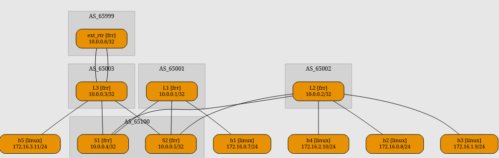

# EVPN

Раз уж мы настраиваем  EVPN/VXLAN в рамках стандартной Clos-топологии, то стоит рассмотреть все части этой фразы. И стандартную Clos-топологии мы уже сделали в underlay.

Теперь же время рассмотреть EVPN/VXLAN (netlab поддерживает еще и MPLS, но VXLAN идет дефолтно). За его настройку отвечает отдельный модуль evpn и модуль vxlan.

Так как все лабы проводятся на образах arista, то выберем их подход в постороении фабрики, то есть eBGP over eBGP ( ну и потому что iBGP over IGP прост, и нюансов при настройке в netlab почти нет).


Так как ариста отказалась запускаться при таком количестве плагинов, этот пример и лаба будут на frr.

Также лаба не запускается в codespace из-за отсутствия там модулей ядра.

Дальнейшие лабы с arista будут iBGP IGP.



**Fixed**

Лаба запускается с ceos и работает на нем в codespace. lab05 обновил, но уменьшил количество спайнов до одного. &#x20;

Не забудьте, что нужно скачать образ cEOS


#### Overlay

Для начала настроим bgp, чтобы evpn строился от lo интерфейсов с multihop

```yaml
plugin: [ebgp.multihop, fabric] # добавим плагин для установления mh сессий
evpn.session: [] # отключаем глобально evpn, чтобы не строил лишнего
bgp.multihop.activate.ipv4: [evpn] # и активируем для mh соседства

bgp.community.ebgp: [standard, extended] # ну extended community, без него не заработает
bgp.sessions.ipv4: [ebgp] # и включаем ipv4 af только для ebgp соседства 
                          # (а то попробует построить ibgp для spine)

bgp.multihop.sessions: # и нужно прописать какие сессии нужно устанавливать
  - L1-S1
  - L2-S1
  - L3-S1
  - L1-S2
  - L2-S2
  - L3-S2
```

Теперь сконфигурируем фабрику

```yaml
fabric:
  spines: 2
  spine:
    module: [bgp, evpn] # тут включим на спайнах evpn
    bgp:
      as: 65100
      next_hop_self: false

  leafs: 3
  leaf:
    module: [vlan, vxlan, bgp, evpn, vrf] # а вот лифам нужно больше
    bgp: 
      as: "{65000 + count}"
      next_hop_self: false
```

#### L2VNI

А теперь нужно сделать базовую связанность между хостами

```yaml
nodes: # добавим сами хосты
  h1:
    device: linux
  h2:
    device: linux
    
vlans:
  red:  # создадим влан
    mode: bridge  # без svi
    vni: 1001 
    links: [L1-h1, L2-h2] # и подключим хосты аксесами к лифам
```

#### L3VNI

И добавим l3 связанность (symmetric irb):

```yaml
vrfs:
  red:
    evpn.transit_vni: 5042 # тут этого достаточно, но необходимо

vlans:
  red1:
    mode: irb  # c svi, есть еще route, он для router on a stick
    vrf: red
    vni: 1001 
    links: [L1-h1] 
  red2:
    mode: irb  # c svi, есть еще route, он для router on a stick
    vrf: red
    vni: 1002
    links: [L2-h2] 
```

Теперь хосты из разных vlan могут общаться между собой.

Но есть проблема, на каждом лифе у одинаковых svi свои ip. А хотелось бы anycast. Давайте добавим. Для этого тоже есть отдельный модуль gateway.

```yaml
fabric:
  leaf:
    module: [vlan, vxlan, bgp, evpn, vrf, gateway] # добавим модуль на нужные устройства
    
vlans:
  red1:
    gateway: True # и включим в нужном влане
```

Модуль берет последний адрес в сети как адрес для anycast gateway.

#### External connectivity

Добавим дополнительные роутер, и соединим с L3 в каждом vrf

```yaml
nodes:
  ext_rtr:
    device: frr
    module: [bgp]
    bgp:
      as: 65999
      originate: "172.16.0.0/12"  # анонсируем summary 

vrfs:
  red:
    evpn.transit_vni: 5042
    # bgp: false                  # тут возникла проблема, о которой ниже
    links: [ext_rtr-L3]
  blue:
    evpn.transit_vni: 5043
    # bgp: false
    links: [ext_rtr-L3]
```

При включеном bgp в vrf устанавливаются соседства между лифами по svi интерфейсам, а с выключеным не устанавливаются соседства с ext\_rtr. Решаемо с помощью netlab config, но не критично в лабораторных.

В итоге получилась такая схема:

<figure><figcaption></figcaption></figure>

Схема сгенерирована с помощью netlab graph и визуализирована в dreampuf.github.io
