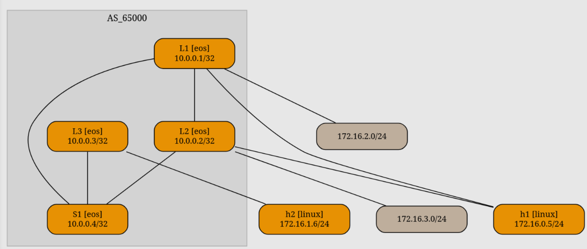

# MLAG

Оставшиеся примеры будут только на eos, так как frr не поддерживает mlag, а es не завезли в netlab для него.

Теперь же займемся отказоустойчивостью. И сразу поменяем eBGP на iBGP и OSPF (просто так, чтобы показать). Ниже будет база новой сети. Всё куда проще, чем с eBGP .&#x20;

```yaml
---
provider: clab
defaults:
  device: eos
  devices.eos.clab.image: ceos:4.34.2f

plugin: [mlag.vtep, fabric] # Тут включим плагин, для добавления секондари/второго лупбека

bgp.as: 65000

fabric:
  spines: 1
  spine:
    module: [bgp, evpn, ospf] # всё что нужно для спайна
  config: [templates/mp]

  leafs: 3
  leaf:
    module: [vlan, vxlan, ospf, bgp, evpn, vrf, gateway, lag] # тут сразу добавим lag, для бондинга

nodes:
  h1:
    device: linux
    module: [lag] # именно этот хост мы и будем подключать в mlag пару
  h2:
    device: linux

vrfs:
  red:
    evpn.transit_vni: 5042

vlans:
  red1:
    vrf: red
    mode: irb
    gateway: True
    vni: 1001
  red2:
    vrf: red
    mode: irb
    gateway: True
    vni: 1002
    links: [L3-h2]
```

Теперь же займемся mlag и бондингом.

```yaml
links:
  - lag:
      members: [L1-L2]
      mlag.peergroup: True # указание на то, что это peer-link
  - vlan.access: red1      # указать в разделе с вланами lag не получится, поэтому коннект перенесем сюда
    lag:
      members: [L1-h1, L2-h1]
```

<figure><figcaption></figcaption></figure>


Тут в темплейтах нет keepalive настроек на уровне темплейтов в ансибле, хотя переменная для него есть. Попробую добавить и потестить.&#x20;


Вот собственно и всё. Только при запуске в интерфейсе vxlan 1 не поменялся сурс интерфейс.&#x20;

Как это исправить мы уже занаем. Поэтому сделаем темплейт и накинем на лифы на этапе валидации, перед проверкой пингом.


```django
interface Vxlan1
 vxlan source-interface Loopback1
```


После всех проверок заглянем прямо на L3 и посмотрим evpn:


```
 * >      RD: 10.0.0.1:1000 imet 10.101.101.1
                                 10.101.101.1          -       100     0       i
 * >      RD: 10.0.0.2:1000 imet 10.101.101.1
                                 10.101.101.1          -       100     0       i
```



```
 * >      RD: 10.0.0.2:1000 mac-ip aac1.ab8c.d2a3
                                 10.101.101.1          -       100     0       i
 * >      RD: 10.0.0.1:1000 mac-ip aac1.ab8c.d2a3 172.16.0.5
                                 10.101.101.1          -       100     0       i
```


А теперь добавим еще тестов для проверки отказоустойчивости:

```yaml
validate:
  change_vx1_lo:
    description: Change vxlan1 source to lo1
    config:
      template: templates/vxlan
    nodes: [L1, L2]
    pass: Vxlan source changed

  ping:
    description: Pinging host from hosts
    nodes: [h1]
    devices: [linux]
    plugin: ping('172.16.1.6')

  lag_test:
    description: Disable one of the links on L1
    nodes: [L1]
    config:
      template: templates/int
      variable.state: down

  failover:
    description: End-to-end connectivity after a LAG member failure
    nodes: [h1]
    wait_msg: Waiting for MLAG convergence
    level: warning
    wait: 5
    plugin: ping('172.16.1.6')

  recover:
    description: Re-enable the link on X1
    nodes: [L1]
    config:
      template: templates/int
      variable.state: up

  lag_testl2:
    description: Disable one of the links on L2
    nodes: [L2]
    config:
      template: templates/int
      variable.state: down

  failoverl2:
    description: End-to-end connectivity after a LAG member failure
    nodes: [h1]
    wait_msg: Waiting for MLAG convergence
    level: warning
    wait: 5
    plugin: ping('172.16.1.6')

  recoverl2:
    description: Re-enable the link on L2
    nodes: [L2]
    config:
      template: templates/int
      variable.state: up
```

И при выполнении получим:

```
[ping]       Pinging host from hosts [ node(s): h1 ]
[PASS]       h1: Ping to 172.16.1.6 succeeded
[PASS]       Test succeeded in 0.2 seconds

[lag_test]   Disable one of the links on L1 [ node(s): L1 ]
[INFO]       Executing configuration snippet templates/int with state=down
[PASS]       Devices configured

[failover]   End-to-end connectivity after a LAG member failure [ node(s): h1 ]
[WAITING]    Waiting for MLAG convergence (retrying for 5 seconds)
[PASS]       h1: Ping to 172.16.1.6 succeeded
[PASS]       Test succeeded in 6.4 seconds

[recover]    Re-enable the link on X1 [ node(s): L1 ]
[INFO]       Executing configuration snippet templates/int with state=up
[PASS]       Devices configured

[lag_testl2] Disable one of the links on L2 [ node(s): L2 ]
[INFO]       Executing configuration snippet templates/int with state=down
[PASS]       Devices configured

[failoverl2] End-to-end connectivity after a LAG member failure [ node(s): h1 ]
[PASS]       h1: Ping to 172.16.1.6 succeeded
[PASS]       Test succeeded in 0.2 seconds

[recoverl2]  Re-enable the link on L2 [ node(s): L2 ]
[INFO]       Executing configuration snippet templates/int with state=up
[PASS]       Devices configured

[SUCCESS]    Tests passed: 7

```
