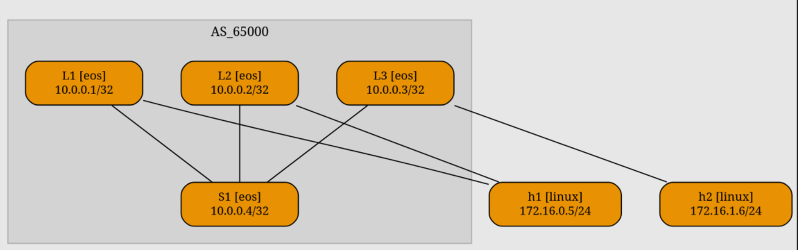

# Multihoming

Тут изменений по сравнению с предыдущим примером будет минимум.

```yaml
plugin: [evpn.multihoming, fabric]

links:
  - vlan.access: red1
    lag:
      members:
        - L1:
            evpn.es: seg_1
          h1:
        - L2:
            evpn.es: seg_1
          h1:
          
```

<figure><figcaption></figcaption></figure>

Вот и все изменения. Достаточно добавить плагин и указать сегмент в lag. Создастся интерфейс Po1 с минимальной настройкой ES

```
interface Port-Channel1
   description [Access VLAN red1] L1 -> [L2,h1]
   switchport access vlan 1000
   evpn ethernet-segment
      identifier 0002:0000:0000:0100:0000
   lacp system-id 0200.0000.0001

```

RD, RT и DF выбираются автоматически, для более детального конфигурирования придется писать свои шаблоны.

В bgp evpn сразу появятся 4 type 4 маршрута&#x20;

```
BGP routing table entry for auto-discovery 0 0002:0000:0000:0100:0000, Route Distinguisher: 10.0.0.1:1000
 Paths: 1 available
  Local
    10.0.0.1 from 10.0.0.1 (10.0.0.1)
      Origin IGP, metric -, localpref 100, weight 0, tag 0, valid, internal, best
      Extended Community: Route-Target-AS:65000:1000 TunnelEncap:tunnelTypeVxlan
      VNI: 1001
BGP routing table entry for auto-discovery 0 0002:0000:0000:0100:0000, Route Distinguisher: 10.0.0.2:1000
 Paths: 1 available
  Local
    10.0.0.2 from 10.0.0.2 (10.0.0.2)
      Origin IGP, metric -, localpref 100, weight 0, tag 0, valid, internal, best
      Extended Community: Route-Target-AS:65000:1000 TunnelEncap:tunnelTypeVxlan
      VNI: 1001
BGP routing table entry for auto-discovery 0002:0000:0000:0100:0000, Route Distinguisher: 10.0.0.1:1
 Paths: 1 available, Priority: high
  Local
    10.0.0.1 from 10.0.0.1 (10.0.0.1)
      Origin IGP, metric -, localpref 100, weight 0, tag 0, valid, internal, best
      Extended Community: Route-Target-AS:65000:1000 TunnelEncap:tunnelTypeVxlan EvpnEsiLabel:0
      VNI: 0
BGP routing table entry for auto-discovery 0002:0000:0000:0100:0000, Route Distinguisher: 10.0.0.2:1
 Paths: 1 available, Priority: high
  Local
    10.0.0.2 from 10.0.0.2 (10.0.0.2)
      Origin IGP, metric -, localpref 100, weight 0, tag 0, valid, internal, best
      Extended Community: Route-Target-AS:65000:1000 TunnelEncap:tunnelTypeVxlan EvpnEsiLabel:0
      VNI: 0

```

И 2 ES&#x20;

```
 * >      RD: 10.0.0.1:1 ethernet-segment 0002:0000:0000:0100:0000 10.0.0.1
                                 10.0.0.1              -       100     0       i
 * >      RD: 10.0.0.2:1 ethernet-segment 0002:0000:0000:0100:0000 10.0.0.2
                                 10.0.0.2              -       100     0       i
```

В блоке с валидацией тоже минимум изменений. Поменял только 3ю проверку ping, так как плагин фейлил из-за потери 1го пакета при переключении на второй лиф.

```yaml
  failoverl2:
    description: End-to-end connectivity after a LAG member failure
    nodes: [h1]
    devices: [linux]
    wait_msg: Waiting for MLAG convergence
    wait: 5
    exec: ping -c 10 h2 -A
    valid: |
      "64 bytes" in stdout
```
