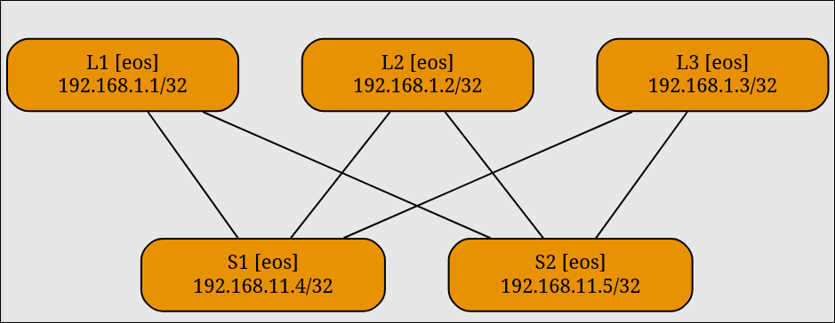

# Выбор underlay

Тут мы выберем между OSPF, ISIS и BGP (eBGP раз уж это underlay). Помсотрим настройки каждого из них. И включим BFD.

Но для начала надо разобраться со сложностью настройки линков между устройствами.

Нам нужно настроить clos топологию, а в netlab есть отдельный [плагин](https://netlab.tools/plugins/fabric/) для быстрого деплоя этой самой топологии.

```yaml
plugin: [fabric]

fabric.spines: 2
fabric.leafs: 3
```

Вот так сразу будут создана clos топология и будут настроены линки между устройствами. Нам осталось только добавить конкретики. Этим мы займемся при настройке ospf.

<figure><figcaption></figcaption></figure>
